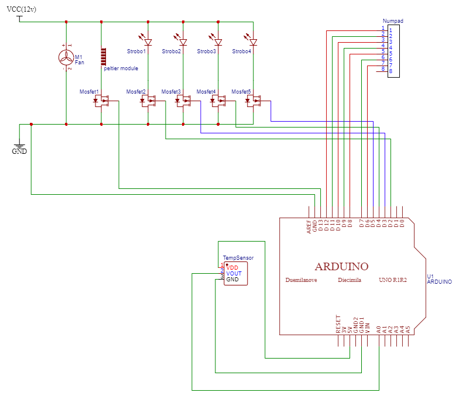
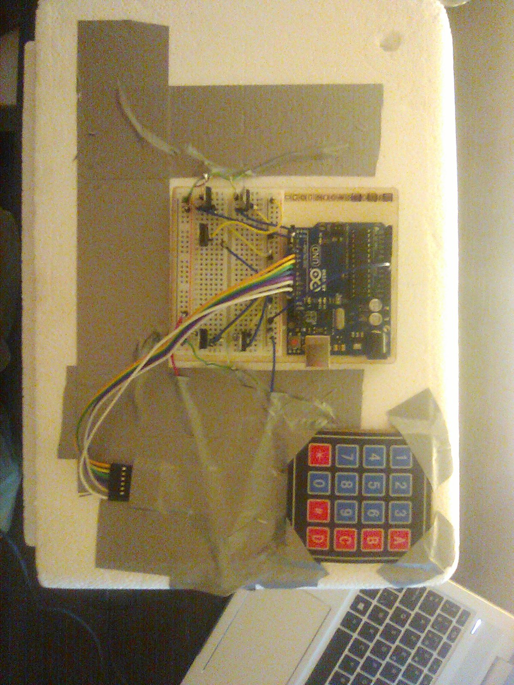

# Spirulina_Project

## Intro

Deze code bestuurt een klimaatbox dat wordt gebruikt voor het groeien van Spirulina. Temperatuur en beluchting gebeuren automatisch en de stroboscopen worden bediend aan de hand van een 4x3 numpad.


## Technisch circuit



Materialen
  - 4 x 12v stroboscopen
  - 5 x MOSFET's
  - 12v computerventilator
  - 12v peltier module
  - Numpad
  - TMP36
  - Arduino UNO

De stroboscoop, ventilator en verwarmingselement zijn parallel geschakeld. Er wordt 12 volt DC toegediend, door de parallelle schakeling krijgt elk apparaat 12v, dit is genoeg om ze allemaal te laten werken.

De stroboscopen en het verwarmingselement worden bediend door een mosfet in serie te plaatsen en de gate te verbinden met de Digital pins op de Arduino UNO.

Wanneer er 5 volt via de arduino naar de mosfet wordt gestuurd onstaat er een elektrisch veld in de mosfet dat er voor zorgt dat elektronen via het mosfet naar de GND kunnen lopen en zo het circuit kunnen sluiten.

Op deze manier kunnen we de stroboscoop en het verwarmingselement aan en uit doen wanneer wij willen.

Het verwarmingselement gaat automatisch aan of uit (hangt af van de input van de temperatuursensor).
De stroboscopen kunnen manueel worden bediend met de numpad.

Er is een TMP36(temperatuursensor) aangesloten met de analoge pin van de Arduino UNO die ons zal helpen de temperatuur te regelen (aan de hand van het peltier module dat geregeld kan worden door een mosfet) in de klimaatbox.

De numpad word aangesloten aan de digital pins van de Arduino UNO, via een gedownloade library kan deze makkelijk bestuurd worden. De digital pins worden door de library als oftewel HIGH of LOW gezet. Zo kan er een circuit nagebootst worden waarbij LOW als GND dient en HIGH als VCC, wanneer een knopje wordt ingeduwd sluit het circuit en krijgt de arduino een signaal.

## Klimaatbox


Alle draadjes zijn strak gesoldeerd, tape is gebruikt om de gaten af te sluiten en om de draden op hun plaats te houden.

Het aanhechten van het houten bord (waarop de arduino en het board zijn geïnstalleerd) is gedaan aan de hand van superlijm.

Het linkerbovengat dient als doorgang voor de TMP36 (deze ga ik op 1 juni installeren).

De numpad werd eerst op een kartonnen vierkant geplakt(met tape) en vervolgens met superlijm op de box geplaatst.

Aan de rechterzijkant is de 12v ventilator geïnstalleerd, dit is gedaan door een gat te maken in de doos om vervolgens de ventilator in het gat vast te zetten. Hetzelfde geldt voor de peltier module die eerst op een koelplaat is aangehecht om vervolgens in de wand van de doos geplaatste te worden.

De ventilator blaast lucht uit de doos naar buiten, zo ontstaat er een drukverschil waardoor er lucht van de andere kant wordt aangetrokken.

De peltier module verwarmt de koelplaat, wanneer lucht wordt aangetrokken door de ventilator zal de lucht die door de koelplaat passeert opwarmen en deze warmte vervoeren naar de spirulina
## Code
(lees eerst de commentaren bij de code vooraleer je hieraan begint. Bovenaan kan je de code openen)

### delay
omdat het programma verschillende tijdsregimes bevat en omdat het constant input moet kunnen lezen is het gebruik van delay onmogelijk. Er is dus een andere manier nodig om dit op te lossen.

```arduino
unsigned long previousMillis = 0;
const long interval = 100;

void loop() {
unsigned long currentMillis = millis();

if (currentMillis - previousMillis >= interval) {
        previousMillis = currentMillis;

        if (ledState == LOW){
         ledState = HIGH;}
        else{
          ledState = LOW;
          }

      
  }
  
}
```
Om de delay te omzeilen wordt de interne klok van de arduino gebruikt die meet hoelang het programma al bezig is (in ms).

Eerst worden er 2 variablen gemaakt: previousMillis en interval.
- Interval: variabel dat bijhoudt hoeveel ms er moeten gepasseerd zijn opdat de if-statement True is. Dit is ook gelijk aan het interval van de stroboscopen.

- previousMillis: variabel dat gerbuikt wordt om wanneer het interval is verschreden, de tijd op een soort van manier te resetten. Natuurlijk gebeurt dit resetten niet echt maar relatief gezien kunnen we het wel zo gebruiken.

Na het interval wordt de currentMillis gelijk gesteld aan de previousMillis, op deze manier reset je de klok.
Bijvoorbeeld:

op tijdstip t = 100ms is het interval beschreden, previousMillis wordt gelijk gesteld aan 100ms. Wanneer t = 200ms is 200ms - previousMillis opnieuw 100ms. Het interval is opnieuw verschreden.

Vervolgens wordt de ledstate oftewel HIGH of LOW gezet (tegenovergesteld van vorige) en krijgen de stroboscopen zo afwisselend 5v en 0v.
