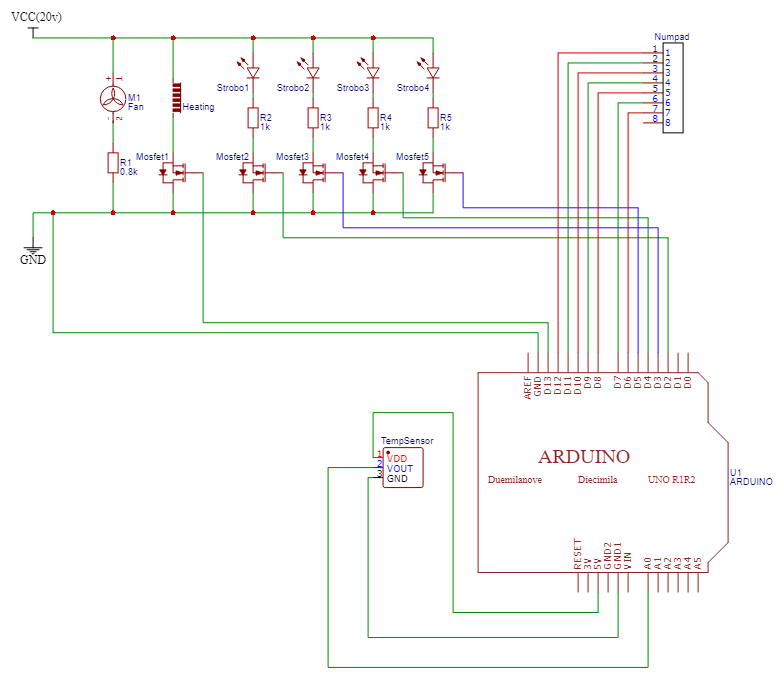

# Spirulina_Project

## Intro

Deze code bestuurt een klimaatbox dat wordt gebruikt voor het groeien van Spirulina. Temperatuur en beluchting gebeuren automatisch en de stroboscopen worden bediend aan de hand van een 4x3 numpad.


## Technisch circuit



Materialen
  - 4 x 10W stroboscopen
  - 5 x MOSFET's
  - 12v computerventilator
  - Verwarmingselement
  - Numpad
  - TMP36
  - Arduino UNO
  - Weerstanden (In deze opstelling 4 x 1k ohm en 1 x 0.8k ohm)

De stroboscoop, ventilator en verwarmingselement zijn parallel geschakelt. Er wordt 20 volt DC toegediend, bij de strobosopen wordt er telkens een weerstand in serie geplaats om ervoor te zorgen dat het potentiaalverschil over de stroboscopen 10v is.
Dit geldt ook voor de ventilator die 12V nodig heeft.
Het verwarmingselement krijgt 20V en heeft dus geen weerstand nodig.

De stroboscopen en het verwarmingselement worden bediend door een mosfet in serie te plaatsen en de gate te verbinden met de Digital pins op de Arduino UNO.

Wanneer er 5 volt via de arduino naar de mosfet wordt gestuurd onstaat er een elektrisch veld in de mosfet dat er voor zorgt dat elektronen via het mosfet naar de GND kunnen lopen en zo het circuit kunnen sluiten.

Op deze manier kunnen we de stroboscoop en het verwarmingselement aan en uit doen wanneer wij willen.

Het verwarmingselement gaat automatisch aan of uit (hangt af van de input van de temperatuursensor).
De stroboscopen kunnen manueel worden bediend met de numpad.

## Code
(lees eerst de commentaren bij de code vooraleer je hieraan begint)

1) ### delay

```arduino
unsigned long previousMillis = 0;
const long interval = 100;

void loop() {
unsigned long currentMillis = millis();

if (currentMillis - previousMillis >= interval) {
        previousMillis = currentMillis;

        if (ledState == LOW){
         ledState = HIGH;}
        else{
          ledState = LOW;
          }

      
  }
  
}
```
Omdat er verschillende tijdsregimes nodig zijn en omdat terwijl het programma loopt er verschillende meetingen moeten gebeuren is het gebruiken van een delay onmogelijk.

Om dit te omzeilen wordt de interne klok van de arduino gebruikt die meet hoelang het programma al bezig is (in ms).

Eerst worden er 2 variablen gemaakt: previousMillis en interval.
- Interval: variabel dat bijhoudt hoeveel ms er moeten gepasseerd zijn opdat de if-statement True is. Dit is ook gelijk aan het interval van de stroboscopen.

